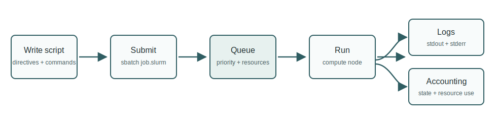

# Episode 1 - Scheduler concepts

Shared HPC systems use schedulers so many users can share limited compute resources fairly and predictably. SLURM receives job requests, chooses when and where they run, starts processes on compute nodes, and records accounting information.



```{admonition} Objectives
:class: tip

After this episode, learners will be able to describe the purpose of a scheduler and distinguish login nodes, compute nodes, jobs, tasks, CPUs, memory, and wall time.
```

## Core concepts

| Term | Meaning |
|---|---|
| Login node | Place to edit files, compile small code, submit jobs, and inspect results |
| Compute node | Place where scheduled computational work runs |
| Job | A resource request submitted to the scheduler |
| Task | A scheduled process, often one MPI rank or one independent command |
| CPU per task | CPU cores allocated to each task |
| Memory | RAM requested for the job |
| Wall time | Maximum elapsed time before the scheduler stops the job |
| Partition | A queue or resource class with specific limits |

## The lifecycle of a job

1. User writes a batch script.
2. User submits it with `sbatch`.
3. SLURM checks resource requests and places the job in the queue.
4. The job starts on compute nodes when resources are available.
5. Output and error logs are written.
6. Accounting records are available after completion.

```{admonition} Discussion: why not run everything on the login node?
:class: note

Login nodes are shared by many users. Heavy CPU, memory, or I/O work can disrupt everyone. Batch jobs move that work to compute nodes with explicit resource limits.
```

## Common learner mistakes

- requesting too little wall time and losing work;
- requesting too much wall time and waiting longer in the queue;
- writing logs to a directory that does not exist;
- confusing tasks with CPU cores;
- using job arrays when one vectorised or batched program would be simpler.

## Key points

- A scheduler is both a resource manager and a workflow boundary.
- Good job scripts make assumptions explicit.
- Most job failures are easier to diagnose when logs and resource requests are clear.
