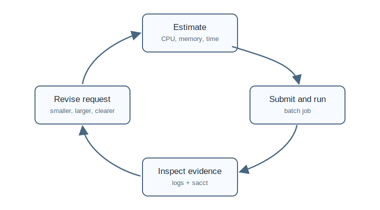

# Episode 3 - Resources and efficiency

Resource requests tell the scheduler what a job needs. Good requests are realistic: large enough to complete, small enough to avoid wasting shared resources.



```{admonition} Objectives
:class: tip

After this episode, learners will be able to choose initial CPU, memory, and wall-time requests; interpret simple efficiency indicators; and improve requests after a completed run.
```

## CPU-bound, memory-bound, and I/O-bound work

| Workload type | Symptom | Resource focus |
|---|---|---|
| CPU-bound | time spent computing | CPUs, threading, vectorisation |
| Memory-bound | large arrays or high resident memory | memory per node or per CPU |
| I/O-bound | slow reads/writes or many small files | filesystem behaviour, batching |

The helper script can simulate each type at small scale:

```bash
python scripts/simulate_workload.py --mode cpu --seconds 2
python scripts/simulate_workload.py --mode memory --megabytes 128
python scripts/simulate_workload.py --mode io --files 20 --directory scratch/io-demo
```

## Read accounting output

```bash
python scripts/summarize_sacct.py data/sample_sacct.csv
```

The summary reports completed, failed, and timed-out jobs, then highlights CPU and memory fields when available.

You can also estimate a conservative next request from completed observations:

```bash
python scripts/plan_resources.py data/resource_observations.csv
```

```{admonition} Exercise: revise a resource request
:class: important

Given a job that requested 8 CPUs, used one CPU heavily, and had low memory use, propose a revised request. Explain how your change may affect queue time and fair resource use.
```

## Key points

- Requesting more resources is not automatically faster.
- Completed jobs provide evidence for better future requests.
- Efficiency is both a technical and shared-system responsibility.
