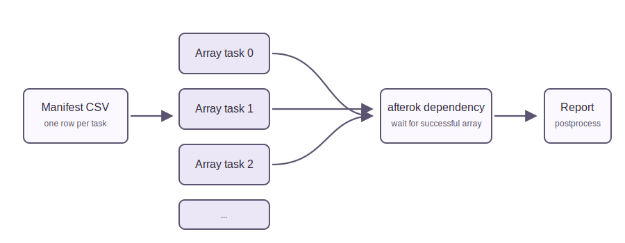

# Episode 4 - Job arrays and dependencies

Many workflows repeat the same command over independent parameters. SLURM job arrays express that pattern without submitting many separate scripts by hand.



```{admonition} Objectives
:class: tip

After this episode, learners will be able to use job arrays for independent tasks and job dependencies for simple staged workflows.
```

## Job arrays

Example:

```bash
#SBATCH --array=0-9

python scripts/simulate_workload.py --mode cpu --seconds "$((SLURM_ARRAY_TASK_ID + 1))"
```

The full example is in `slurm/array_parameter_sweep.slurm`.

Use arrays when tasks are independent and share the same script structure. Avoid arrays when tasks strongly communicate with each other or when one vectorised program would be simpler.

For more realistic workflows, array inputs can come from a manifest file. This makes the parameter set reviewable before submission:

```bash
python scripts/make_array_manifest.py --output data/generated_manifest.csv --count 6 --mode cpu
```

## Dependencies

Dependencies express order:

```bash
first=$(sbatch --parsable slurm/basic_python_job.slurm)
second=$(sbatch --parsable --dependency=afterok:${first} slurm/dependent_postprocess.slurm)
echo "Submitted ${first} then ${second}"
```

The full example is in `slurm/submit_dependency_chain.sh`.

```{admonition} Exercise: choose the workflow pattern
:class: important

You need to process 120 independent files and then combine the outputs into one report. Which part should be a job array? Which part should depend on successful completion? Sketch the commands.
```

## Key points

- Arrays are for independent repeated work.
- Dependencies are for ordered stages.
- Good workflows make both parallelism and ordering explicit.
